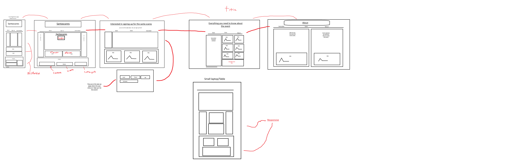
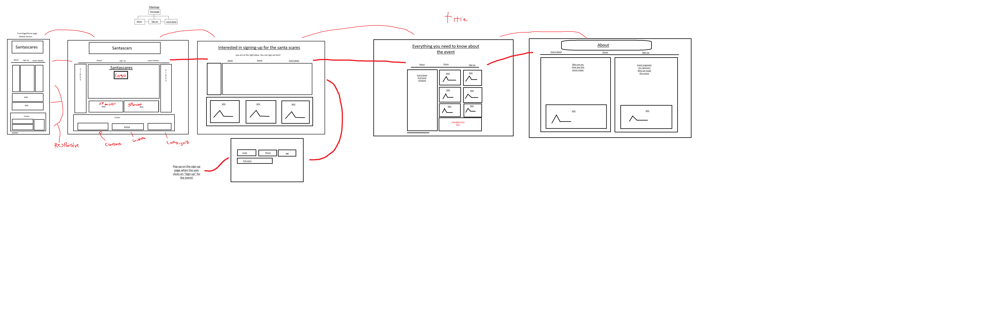

<h1>VefThroun</h1>

 

<h2>Website project in vefThroun.</h2>

<strong>
    
My Theme is:

    
Halloween x Christmas.

    
Santascares, comes only once a year! Don't miss it.

</strong>

<h3>
    
The font that is used for the website is called <a href="https://fonts.google.com/specimen/Creepster">creepster</a>

</h3>

<strong>Wireframe and Sitemap</strong>
<h2>Wireframe</h2>

<h2>sitemap</h2>

