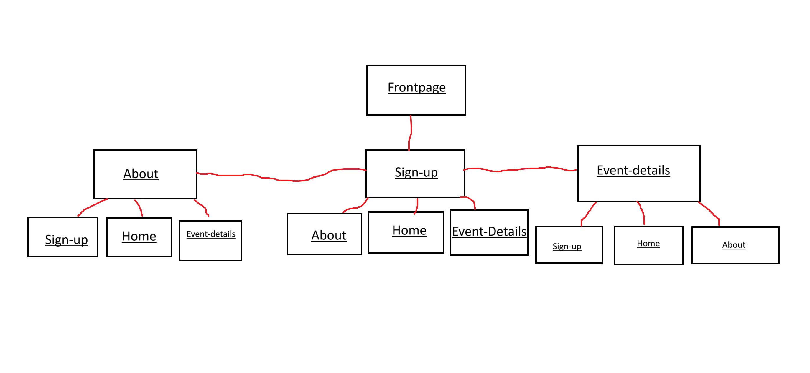

<h1>VefThroun</h1>

 

<h2>Website project in vefThroun.</h2>

<strong>
    
My Theme is:

    
Halloween x Christmas.

    
Santascares, comes only once a year! Don't miss it.

</strong>

<strong>
    <h1>Color Theme</h1>
    <h4>The Colors style on the website are mostly:</h4>
    <h3>Black - #000000</h3>
    <h3>White - #FFFFFF</h3>
    <h3>Orange - #FFA500</h3>
    <h3>Red - #FF0000</h3>
    <h3>Purple/Violet - #6C0BA9</h3>
    <h3>Gray-ish blue - #2E5984</h3>
</strong>

<h3>
    
The font that is used for the website is called <a href="https://fonts.google.com/specimen/Creepster">creepster</a>

</h3>

<strong>Wireframe and Sitemap</strong>
<h2>Wireframe</h2>

<h2>sitemap</h2>

